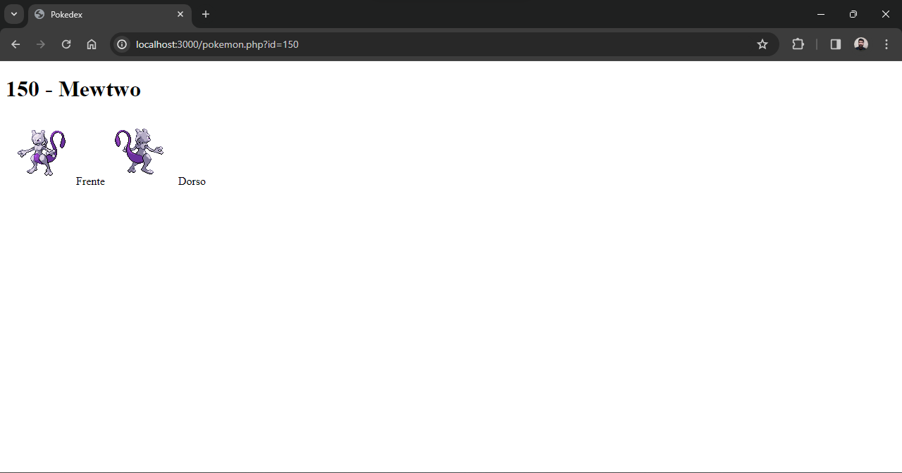

# Pokedex
Esta pokedex al iniciar muestra la región de cada una de las 9 generaciones de pokemones. Al hacer clic en cualquiera de los enlaces, se muestra la lista de los pokemones originarios de esa región, cada uno de los cuales tiene un enlace al artículo de ese pokemon con sprite delantero y trasero.

This pokedex shows in the index the region of each of the 9 generations of pokemon. Clicking on any of the links displays the list of Pokémon original from that region, each of which has a link to that Pokémon's article with front and back sprites.

## Screenshots

  

  
